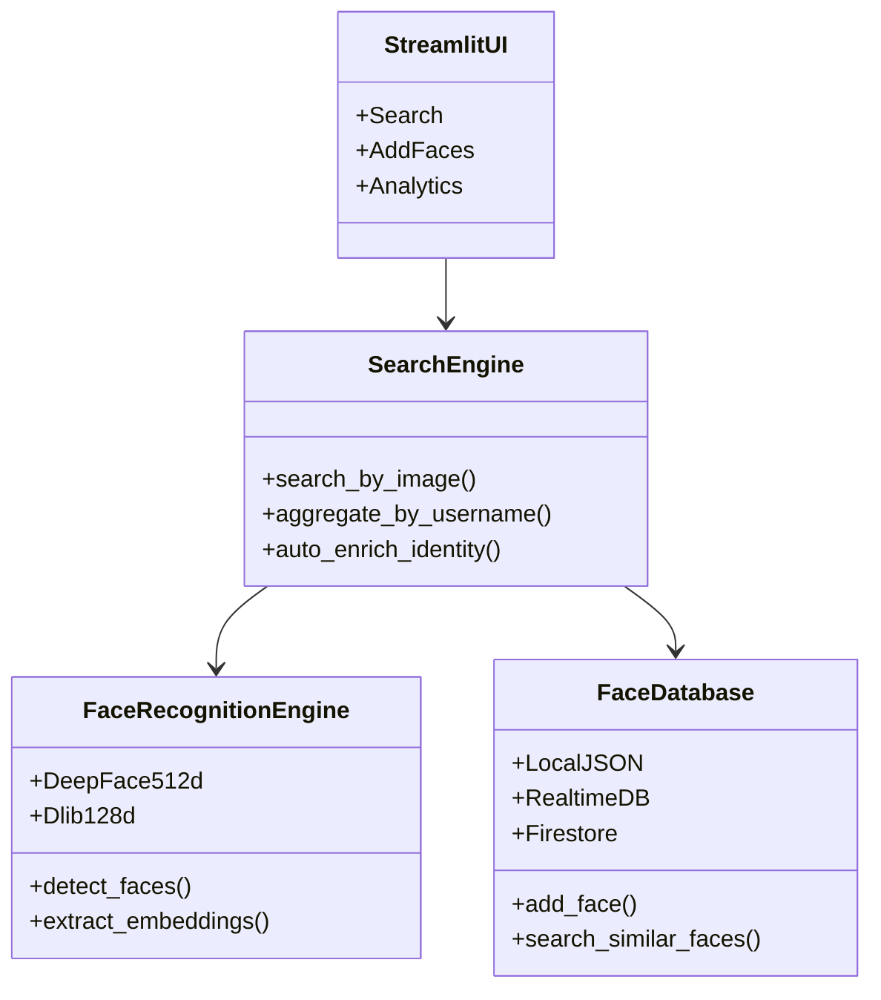

# SocialVision — Intelligent Facial Recognition Search Engine

[](https://python.org)
[](https://streamlit.io)
[](https://github.com/serengil/deepface)
[](https://github.com/ageitgey/face_recognition)
[](https://www.docker.com/)
[](LICENSE)

SocialVision is an **intelligent facial recognition and identity search system** designed for real-time face detection, verification, and similarity-based identity retrieval across operator-curated visual datasets.

The project implements an **end-to-end computer vision and deep learning pipeline**, combining **DeepFace (Facenet512, TensorFlow/Keras)** embeddings with **dlib / face_recognition** encodings. These dual embeddings are fused per detected face to improve robustness, confidence scoring, and real-world reliability.

SocialVision supports **automatic dataset enrichment, self-training identity profiles, and adaptive learning workflows**, allowing the system to continuously improve recognition accuracy as new faces are searched and verified. The platform is exposed through a **Streamlit-based command interface**, backed by a local JSON or Firestore database, Dockerized operations, and automated tests to ensure reproducibility and research-grade quality.

> **Positioning:** Research-grade facial recognition system demonstrating real-world AI pipelines, adaptive learning, and scalable computer vision architectures.

> **Maintainer**: Mihretab N. Afework ([@Mih-Nig-Afe](https://github.com/Mih-Nig-Afe)) · <mtabdevt@gmail.com>

---

## Contents

1. [Capabilities](#capabilities)
2. [Architecture](#architecture)
3. [Getting Started](#getting-started)
4. [Usage](#usage)
5. [Configuration](#configuration)
6. [Documentation Map](#documentation-map)
7. [Testing](#testing)
8. [Roadmap & Contributing](#roadmap--contributing)

---

## Capabilities

| Area | Highlights |
|------|------------|
| **Dual Embedding Pipeline** | DeepFace (Facenet512) + dlib encodings stored side-by-side, weighted similarity scoring, and safe handling of mixed dimensions (e.g. 128 vs 512). |
| **Facial Recognition Search Engine** | Mode-agnostic matching: whatever extraction mode is used, search compares against the whole DB using compatible embedding keys and dimensions. |
| **Self-Training Profiles** | Confident matches trigger enrichment that **adds only missing embedding keys (“dimensions”)** for that identity instead of re-uploading everything. |
| **Input Modes** | Image upload, video upload (frame sampling), and live camera. Live camera runs via WebRTC when available; a capture-based fallback exists for environments without WebRTC support. |
| **Face Quality Gate** | Optional face quality scoring (blur/brightness/contrast/sharpness) plus auto-improvement (CLAHE/denoise/sharpen) before adding/enriching faces. |
| **High-Fidelity Preprocessing** | Real-ESRGAN is the default super-resolution backend with configurable pass counts, minimum trigger scale, and per-image tile targeting (e.g., force ~25 tiles per inference) while the IBM MAX sidecar and NCNN CLI remain optional accelerators. When GPU memory is unavailable, the pipeline automatically clamps to CPU-safe settings before falling back on OpenCV/Lanczos. |
| **Streamlit Command Center** | Tabs for Search, Add Faces, Analytics; live metrics, threshold sliders, backend telemetry, and enrichment summaries meant for operator demos. |
| **FastAPI Service (Optional)** | REST endpoints for search/add/enrich over images, videos, and camera frames (base64), plus a `/health` readiness endpoint. |
| **Data Layer** | Supports local JSON, Firebase Realtime Database (incremental writes + delta embedding patches), and Firestore. `DB_TYPE=firebase` prefers Realtime DB first, then falls back to Firestore, then local JSON. |
| **Operations** | Docker image designed for reproducible builds (layer caching, staged dependency installs), DeepFace weight prefetch, CLI demo script, logging + health checks. |
| **Quality & Docs** | Pytest coverage for engine/database/search, reproducible fixtures, comprehensive docs mirroring professional OSS projects. |

---

## Architecture

For full UML-style diagrams (system context, sequences, DB backend selection), see **[docs/ARCHITECTURE.md](docs/ARCHITECTURE.md)**.



- **Detection/Embedding**: `FaceRecognitionEngine` first attempts DeepFace (Facenet512) and, based on config, also runs dlib encoders. Embeddings are normalized, bundled, and tagged per backend (`{"deepface": [...], "dlib": [...]}`).
- **Storage/Search**: `FaceDatabase` stores both the bundle and a primary embedding for backward compatibility, computes weighted cosine similarities, and maintains username centroids for quick identity queries.
- **Self-Training Loop**: `SearchEngine` serializes the embeddings from every detected face during a search. If the top match surpasses the similarity threshold, `_auto_enrich_identity` writes the new bundle back to the matched username with provenance metadata, effectively “training” that profile using real-world query photos and expanding dimensions such as total embeddings, last-added face ID, and similarity history.
- **Upscaling Stack**: Native Real-ESRGAN now leads the stack with tunable passes, minimum AI trigger scale, and per-frame tile targeting (`IMAGE_UPSCALING_TARGET_TILES`). IBM MAX (optional sidecar) and the NCNN Real-ESRGAN CLI remain ahead of OpenCV/Lanczos in the automatic fallback chain, and CPU-only hosts auto-clamp to a single 4× pass to stay responsive.
- **Presentation / Ops**: Streamlit orchestrates searches and enrichment, while Docker provides an isolated runtime with cached pip layers and pre-fetched DeepFace weights.

---

## Getting Started

### Prerequisites

- Python 3.9+
- pip
- Git
- (Optional) Docker 24+ with BuildKit enabled

### Local Setup

```bash
git clone https://github.com/Mih-Nig-Afe/SocialVision-Facial-Recognition-Search.git
cd SocialVision-Facial-Recognition-Search
python -m venv .venv && source .venv/bin/activate
pip install --upgrade pip
pip install -r requirements.txt
```

Launch Streamlit:

```bash
streamlit run src/app.py
```

### Docker Workflow (recommended for demos)

```bash
docker compose build
docker compose up -d
# or
./docker-demo.sh
```

Features of the container image:

- Uses Docker layer caching and staged dependency installs to reduce rebuild time for large ML packages.
- Pre-fetch of DeepFace weights during build, reducing cold-start latency.
- Health check hitting `/_stcore/health` to signal readiness.
- Real-ESRGAN weights baked into `models/` plus environment-driven tiling so Docker-on-Mac users can force ~25 tiles per frame without editing code.
- Optional [IBM MAX Image Resolution Enhancer](https://github.com/IBM/MAX-Image-Resolution-Enhancer) sidecar (`ibm-max`). The shipped `docker-compose.yml` keeps it commented out and `IBM_MAX_ENABLED=false` by default; enable it on x86 hosts if you want IBM MAX ahead of the Real-ESRGAN/OpenCV/Lanczos fallback chain.

Access the UI at `http://localhost:8501`.

> **Apple Silicon note:** IBM's published MAX image is Intel-only and requires AVX instructions. On M-series Macs the container typically restarts with `Illegal instruction` even under emulation. In that case either (a) set `IBM_MAX_ENABLED=false` and run `docker compose up -d socialvision` to rely on the bundled Real-ESRGAN stack (which now auto-tiles on CPU), or (b) point `IBM_MAX_URL` to a remote MAX deployment you control (for example an x86 cloud VM exposing the same API).

---

## Usage

### Streamlit Tabs

1. **🔍 Search** – Upload an image, system detects faces, extracts dual embeddings, and surfaces matches with similarity scores. When a match exceeds the configured threshold, that same embedding bundle is appended to the matched profile automatically, so the database keeps training itself from real search traffic.
2. **📤 Add Faces** – Upload faces for specific usernames; the UI now uploads full embedding bundles so the database can blend DeepFace+dlib vectors.
3. **📈 Analytics** – Watch total faces, unique users, and per-source charts sourced directly from the JSON database.

### FastAPI (Optional)

The repo includes a FastAPI app at `src/api.py`.

Run locally:

```bash
uvicorn src.api:app --host 0.0.0.0 --port 8000
```

Then open Swagger UI at `http://localhost:8000/docs`.

Implemented endpoints (high level):

- `POST /api/enrich-face` (image upload)
- `POST /api/enrich-video` (video upload + frame sampling)
- `POST /api/search-face` (image upload)
- `POST /api/search-video` (video upload)
- `POST /api/search-camera` (base64 camera frame)
- `POST /api/add-face` (image upload)
- `POST /api/add-video` (video upload)
- `GET /health`

### Programmatic Example

```python
from src.database import FaceDatabase
from src.face_recognition_engine import FaceRecognitionEngine

db = FaceDatabase()
engine = FaceRecognitionEngine()

image, bundles = engine.process_image("path/to/photo.jpg")
for bundle in bundles:
    db.add_face(bundle, username="research_subject", source="post")

query_results = db.search_similar_faces(bundle, threshold=0.35, top_k=5)
```

---

## Configuration

Key environment variables (see `src/config.py` for defaults):

| Variable | Description |
|----------|-------------|
| `DEEPFACE_MODEL` | DeepFace backbone (default `Facenet512`). |
| `DEEPFACE_DETECTOR_BACKEND` | Detector backend (default `opencv`). |
| `ENABLE_DUAL_EMBEDDINGS` | `true` to run DeepFace + dlib together (default `true`). |
| `DEEPFACE_EMBEDDING_WEIGHT` / `DLIB_EMBEDDING_WEIGHT` | Similarity weights applied during search. |
| `FACE_SIMILARITY_THRESHOLD` | Global cosine similarity cut-off. |
| `IMAGE_UPSCALING_ENABLED` | Enables the multi-backend super-resolution pipeline before detection (default `true`). |
| `IMAGE_UPSCALING_BACKEND` / `IMAGE_UPSCALING_TARGET_SCALE` | Choose the native Real-ESRGAN model (e.g. `realesrgan_x4plus` or the new `realesrgan_x6plus` alias) and preferred out-scale for local inference. |
| `IMAGE_UPSCALING_MAX_PASSES` | Maximum number of Real-ESRGAN passes to chain (default `2`) before falling back to OpenCV/Lanczos, keeping RAM usage predictable. |
| `IMAGE_UPSCALING_TARGET_TILES` | Desired number of Real-ESRGAN tiles per frame (default `0`, meaning “use the configured tile size”). Set to `25` to force roughly a 5×5 grid so that every image benefits from tiled inference, even on CPU-only Docker. |
| `IMAGE_UPSCALING_MIN_REALESRGAN_SCALE` | Smallest requested upscale factor that still triggers Real-ESRGAN (default `1.05`). Set to `1.0` to always run the AI upscaler even for near-1× touch-ups, or raise it if you prefer to skip Real-ESRGAN for tiny adjustments. |
| `IBM_MAX_ENABLED` / `IBM_MAX_URL` / `IBM_MAX_TIMEOUT` | Toggle the IBM MAX Image Resolution Enhancer client, set its base URL, and override HTTP timeout. Note: `docker-compose.yml` disables IBM MAX by default for portability; `.env.example` shows an opt-in configuration. |
| `IBM_MAX_HOST_PORT` | Docker/Compose-only variable (not read by the Python app). Controls which host port maps to the IBM MAX container when you run the optional `ibm-max` service. |
| `IBM_MAX_PLATFORM` | Docker/Compose-only variable (not read by the Python app). Sets the `platform:` for the optional IBM MAX service (typically `linux/amd64`). |
| `IBM_MAX_FAILURE_THRESHOLD` | Number of consecutive IBM MAX call failures allowed before the client auto-disables for the session (default `3`). |
| `IBM_MAX_PROBE_ON_START` | `true` probes `/model/metadata` on startup and disables IBM MAX immediately if the endpoint cannot be reached (code default `false`). |
| `NCNN_UPSCALING_ENABLED` / `NCNN_EXEC_PATH` / `NCNN_MODEL_NAME` | Configure the standalone Real-ESRGAN NCNN Vulkan executable path, model, and tiling so it can act as the next fallback when IBM MAX is unavailable. |
| `MULTI_BACKEND_EXTRACTION` | When `true` (default), tries original + multiple preprocessing backends to maximize successful embedding extraction. |
| `IMAGE_UPSCALING_BACKEND_PRIORITY` | Comma-separated backend order (default `realesrgan,opencv,lanczos`) used for automatic fallback selection. |
| `MAX_IMAGE_SIZE` / `MAX_VIDEO_SIZE` | Maximum upload sizes (bytes) for images/videos. |
| `VIDEO_FRAME_STRIDE` / `VIDEO_MAX_FRAMES` | Video sampling controls for video upload/search/add flows. |
| `EMBEDDING_CACHE_TTL_LOCAL` / `EMBEDDING_CACHE_TTL_FIRESTORE` | Ultra-fast (in-memory) embedding cache TTLs for fast-mode search paths. |
| `LOCAL_DB_PATH` | Path to JSON database (default `data/faces_database.json`). |
| `DB_TYPE` | `local`, `firestore`, `realtime`, or `firebase` (Realtime preferred → Firestore fallback → local fallback); controls which backend `FaceDatabase` instantiates. |
| `FIREBASE_DATABASE_URL` | Realtime Database URL (e.g. `https://<project>.firebaseio.com`). |
| `FIREBASE_DB_ROOT` | Realtime Database root path (default `faces_database`). |
| `REALTIME_DELTA_EMBEDDINGS` | When `true` (default), Realtime DB writes patch only missing embedding keys instead of re-uploading whole records. |
| `REALTIME_STORE_PROFILE_EMBEDDING` | When `true`, persists per-username centroid embeddings to Firebase; default `false` to minimize payload size. |
| `LIVE_AUTO_ENRICH_ENABLED` | Enables live-camera auto-enrichment after confident matches (default `true`). |
| `LIVE_AUTO_ENRICH_FLUSH_SECONDS` | Batch flush interval for live-camera enrichment (default `2`). |
| `LIVE_AUTO_ENRICH_MAX_PENDING` | Batch size threshold for live-camera enrichment flush (default `25`). |
| `LIVE_AUTO_ENRICH_COOLDOWN_SECONDS` | Per-username cooldown for live enrichment to prevent spam (default `0`). |
| `ULTRA_FAST_EMBEDDING_KEY` | Embedding key used by ultra-fast search (default `dlib`). |
| `FIRESTORE_DATABASE_ID` | Firestore database ID (default `(default)`). |
| `FIRESTORE_LOCATION_ID` | Region for Firestore (e.g. `us-central`, `nam5`). |
| `UPSCALE_RETRY_ENABLED` | Enables the “detect → upscale → retry” workflow when faces/embeddings/matches aren’t found (default `true`). |
| `UPSCALE_RETRY_ON_ZERO_MATCH` | When `true`, the retry also runs if embeddings exist but no matches clear the threshold (default `true`). |
| `UPSCALE_RETRY_MIN_OUTSCALE` | Minimum outscale factor applied during the retry upscaling sequence (default `2.0`). |
| `UPSCALE_RETRY_BACKENDS` | Comma-separated list of backends to try during retries, ordered by priority (default `ibm_max,realesrgan,opencv,lanczos`). |

> **Upscaling note:** With **12GB** allocated to Docker/Compose the app can chain up to **two** Real-ESRGAN passes using the `realesrgan_x6plus` preset (`IMAGE_UPSCALING_TARGET_SCALE=8.0`, `IMAGE_UPSCALING_MAX_PASSES=2`). On CPU-only hosts the code automatically clamps to a single 4× Real-ESRGAN pass (plus a lightweight interpolation touch-up) to keep processing times reasonable; CUDA-equipped machines keep the full multi-pass sequence. If PyTorch reports an out-of-memory error on any pass the code retries at a smaller scale (or the previous successful pass) before falling back to OpenCV/Lanczos. Lower these env vars on leaner machines.

Add optional secrets (Firebase, etc.) via `.env` or environment-specific config classes.

### Using Firestore or Firebase Realtime Database instead of the local JSON database

The data layer can be switched to **Google Cloud Firestore (native mode)** so that no facial embeddings are ever written to local disk. To connect the app to your project:

1. **Create (or plan) a Firestore database** in the Firebase console (select *Firestore*, not the Realtime Database), choose *Native* mode, and note the region (e.g. `nam5`). If the default database does not yet exist, SocialVision can now auto-provision it via the Firestore Admin API.
2. **Generate a service-account key** with `Cloud Datastore Owner` **or** a role that includes `databases.create`, `databases.get`, and standard read/write permissions (e.g. `roles/datastore.user`). Download the JSON key, move it to `config/firebase_config.json`, and keep it out of version control (the path is already gitignored). Rotate any key that may have been committed previously.
3. **Install the cloud persistence dependencies** (`firebase-admin`, `google-cloud-firestore`, `google-auth`) using `pip install -r requirements.txt`, then export the following variables before running Streamlit or the Docker image:

    ```bash
    # Firestore (forced)
    export DB_TYPE=firestore
    export FIREBASE_ENABLED=true           # optional flag used elsewhere in the app
    export FIREBASE_PROJECT_ID="your-project-id"
    export FIREBASE_CONFIG_PATH="$PWD/config/firebase_config.json"
    export FIRESTORE_COLLECTION_PREFIX="socialvision_"   # optional namespace
    export FIRESTORE_DATABASE_ID="(default)"             # leave as default unless you created a named DB
    export FIRESTORE_LOCATION_ID="us-central"            # region/nam5/etc from step 1
    ```

    ```bash
    # Firebase Realtime Database (forced)
    export DB_TYPE=realtime
    export FIREBASE_ENABLED=true
    export FIREBASE_PROJECT_ID="your-project-id"
    export FIREBASE_CONFIG_PATH="$PWD/config/firebase_config.json"
    export FIREBASE_DATABASE_URL="https://<project>.firebaseio.com"
    export FIREBASE_DB_ROOT="faces_database"  # optional
    ```

    ```bash
    # Auto mode: prefer Realtime Database, fall back to Firestore, then local JSON
    export DB_TYPE=firebase
    export FIREBASE_ENABLED=true
    export FIREBASE_PROJECT_ID="your-project-id"
    export FIREBASE_CONFIG_PATH="$PWD/config/firebase_config.json"
    export FIREBASE_DATABASE_URL="https://<project>.firebaseio.com"  # used on fallback
    ```

    When running in Docker, mount the credentials file (e.g. `-v $PWD/config/firebase_config.json:/app/config/firebase_config.json:ro`) and pass the same environment variables via `docker compose`.

4. Start the app (`streamlit run src/app.py` or `docker compose up`). If the `(default)` database is missing, SocialVision will invoke the Firestore Admin API (using your service account) to create it in the region you specified. Afterwards, the backend creates two collections—`<prefix>faces` and `<prefix>profiles`—and every new embedding bundle is written directly to Firestore. Profile centroids stay cached in `<prefix>profiles` for fast identity searches.

With `DB_TYPE=firestore`, the project never exports face data to `data/faces_database.json`; enrichment, search, and analytics all operate against Firestore in real time.

With `DB_TYPE=realtime` (or `DB_TYPE=firebase` when Realtime DB is available), writes are incremental and enrichment prefers **delta-only patches** (upload only missing embedding keys).

---

## Documentation Map

- **[docs/README.md](docs/README.md)** – navigation hub.
- **[docs/ARCHITECTURE.md](docs/ARCHITECTURE.md)** – UML diagrams + end-to-end processing flows.
- **[docs/API_USAGE.md](docs/API_USAGE.md)** – FastAPI endpoints + runnable examples.
- **[docs/CURRENT_CAPABILITIES.md](docs/CURRENT_CAPABILITIES.md)** – quick reference for what works today.
- **[docs/PROJECT_STATUS.md](docs/PROJECT_STATUS.md)** – phase progress, KPIs, and blocking issues.
- **[docs/TESTING_GUIDE.md](docs/TESTING_GUIDE.md)** – manual + automated test instructions.
- **[docs/DEVELOPMENT_ROADMAP.md](docs/DEVELOPMENT_ROADMAP.md)** – upcoming milestones.
- **[docs/DOCKER_TESTING_GUIDE.md](docs/DOCKER_TESTING_GUIDE.md)** – container-focused workflows.

---

## Testing

```bash
pytest tests/ -v

# Focused runs
pytest tests/test_face_recognition.py -v
pytest tests/test_database.py -v
pytest tests/test_search_engine.py -v
```

All three suites are CI-friendly and cover the dual-embedding engine, bundle-aware database, and enrichment logic.

---

## Keywords & Domains

facial recognition · computer vision · deep learning · machine learning · identity verification · face detection · biometric systems · AI pipelines · self-training systems · adaptive learning · real-time vision · dataset enrichment · Python · OpenCV · DeepFace · Streamlit

## Roadmap & Contributing

**Current focus:**

- Expanding dataset ingestion (automated capture jobs, Firebase sync)
- Hardening API surface (FastAPI service layer)
- Enhancing scalability (vector index, embeddings rebalancing)

Contributions are welcome:

1. Fork the repo.
2. Create a feature branch.
3. Add/modify code + docs + tests.
4. Open a pull request describing the change and verification steps.

Please review the [Development Roadmap](docs/DEVELOPMENT_ROADMAP.md) and [Testing Guide](docs/TESTING_GUIDE.md) before submitting changes.

---

## Contact

- Email: <mtabdevt@gmail.com>
- GitHub: [@Mih-Nig-Afe](https://github.com/Mih-Nig-Afe)
- LinkedIn: [Mihretab N. Afework](https://linkedin.com/in/mihretab-afework)

---

*SocialVision is built for academic and ethical research demonstrations. Use responsibly and respect privacy regulations in your jurisdiction.*
