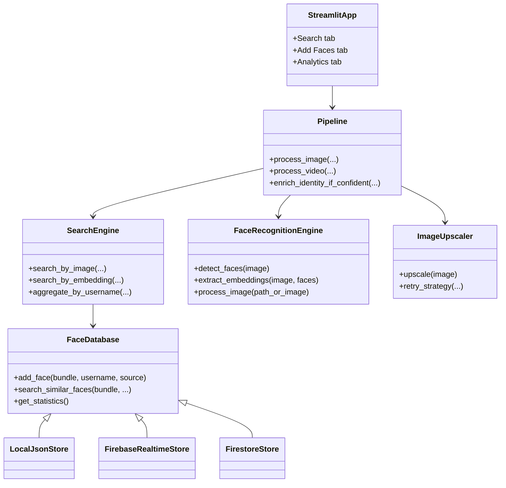
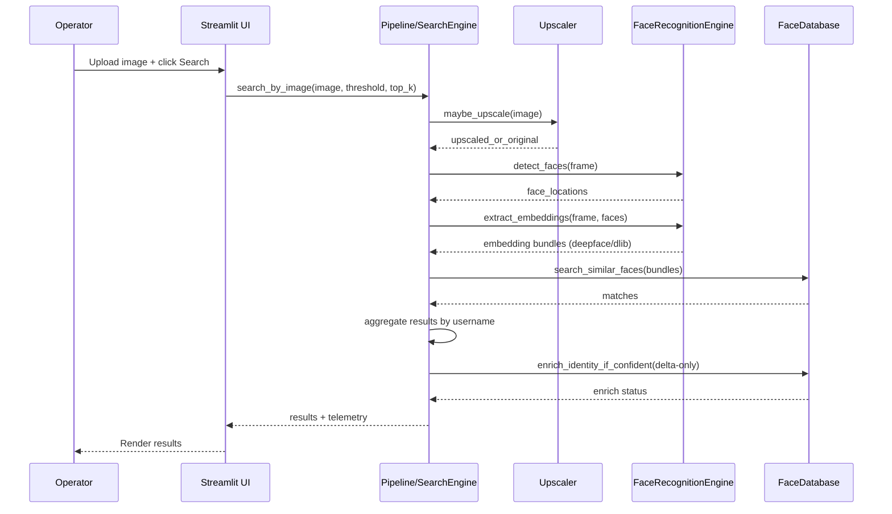
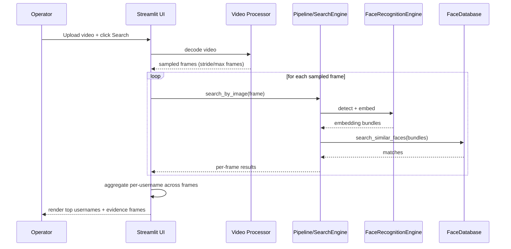
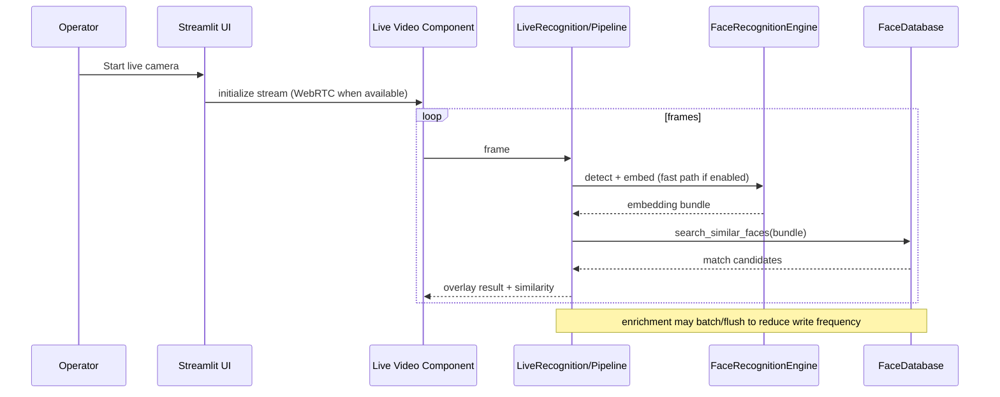
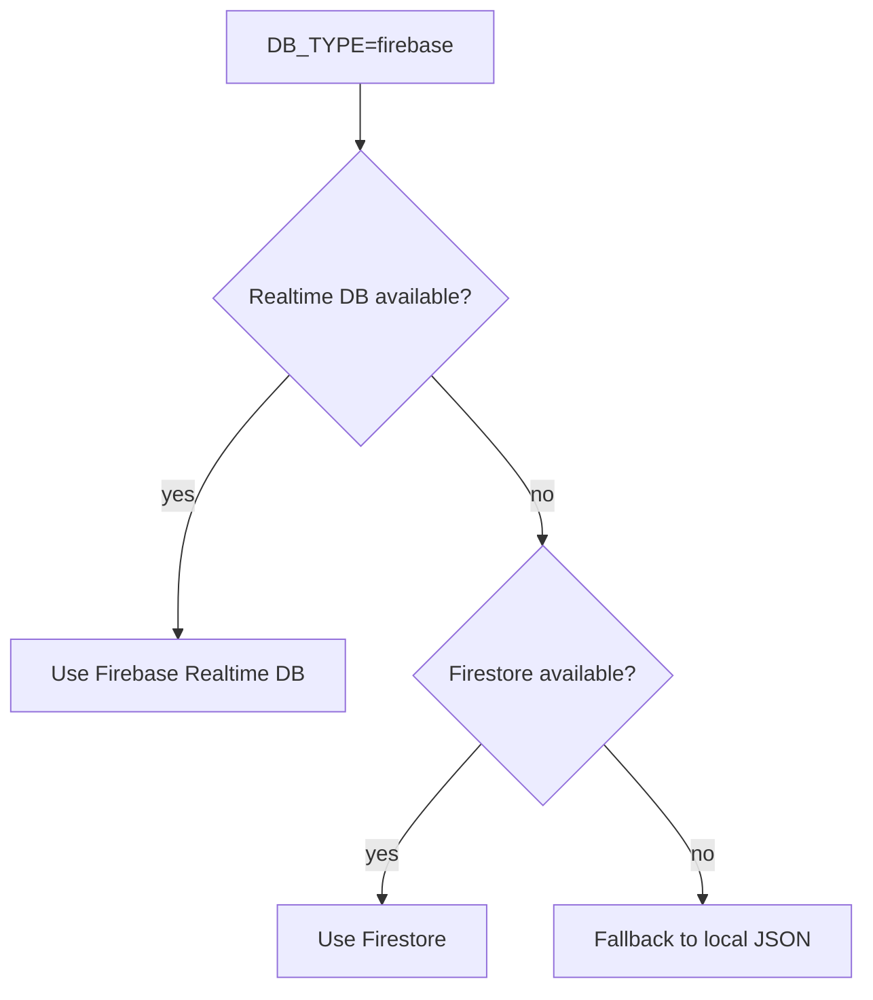

# SocialVision Architecture

**Version:** 1.0.0  
**Last Updated:** January 2026  
**Audience:** Engineers, QA, demo facilitators

---

## Overview

SocialVision is an end-to-end facial recognition search system built around a Streamlit UI and a pipeline that:

1. Ingests inputs (image upload, video upload, or live camera)
2. Optionally upscales frames/images
3. Detects faces and extracts embeddings (DeepFace 512-d when enabled, plus optional dlib 128-d)
4. Searches against a multi-backend database (local JSON, Firebase Realtime Database, Firestore)
5. Aggregates results and optionally enriches identities with delta-only embedding updates

This document focuses on **runtime architecture**, **data flow**, and **how processing happens**.

---

## System Context (High-Level)

If your Markdown viewer does not render Mermaid diagrams, scroll to **Always-Visible Diagrams (ASCII)** below.

```mermaid
flowchart LR
  User((Operator)) -->|Browser| StreamlitUI[Streamlit UI\nSearch / Add Faces / Analytics]
  StreamlitUI --> Pipeline[Pipeline + SearchEngine\n(face detection, embedding, search, enrichment)]

  Pipeline --> Upscaler[Image Upscaler\nReal-ESRGAN / Optional IBM MAX / Fallbacks]
  Pipeline --> FaceEngine[FaceRecognitionEngine\nDeepFace + dlib]
  Pipeline --> DB[FaceDatabase\nlocal JSON / Realtime DB / Firestore]

  DB --> LocalJSON[(data/faces_database.json)]
  DB --> RTDB[(Firebase Realtime DB)]
  DB --> Firestore[(Google Firestore)]

  Pipeline --> Logs[(logs/)]
```

---

## Always-Visible Diagrams (ASCII)

### A) System Context (what talks to what)

```text
  +-----------+        +-------------------+        +-----------------------------+
  | Operator  | -----> | Streamlit UI      | -----> | Pipeline / SearchEngine     |
  | (browser) |        | (Search/Add/Stat) |        | (orchestration + logic)     |
  +-----------+        +-------------------+        +-----------------------------+
                                                      |      |           |
                                                      |      |           |
                                                      v      v           v
                                            +--------------+  +---------------------+  +------------------+
                                            | ImageUpscaler|  | FaceRecognitionEngine|  | FaceDatabase      |
                                            | (Real-ESRGAN |  | (DeepFace + dlib)    |  | (local/RTDB/FS)   |
                                            |  optional MAX|  +---------------------+  +------------------+
                                            |  fallbacks)  |                           |   |     |     |
                                            +--------------+                           v   v     v     v
                                                                                      JSON RTDB Firestore Logs
```

### B) Database selection (DB_TYPE)

```text
DB_TYPE=local      -> local JSON
DB_TYPE=realtime   -> Firebase Realtime Database
DB_TYPE=firestore  -> Firestore

DB_TYPE=firebase auto-mode:

  [Try Realtime DB] --ok--> use RTDB
        |
        no
        v
  [Try Firestore]   --ok--> use Firestore
        |
        no
        v
  [Fallback]              use local JSON
```

### C) Sequence: image search (happy path)

```text
Operator -> UI : upload image + Search
UI -> Pipeline/SearchEngine : search_by_image
Pipeline -> Upscaler : maybe_upscale
Pipeline -> FaceRecognitionEngine : detect_faces + extract_embeddings
Pipeline -> FaceDatabase : search_similar_faces
Pipeline -> Pipeline : aggregate results by username
Pipeline -> FaceDatabase : optional delta-only enrich on confident match
Pipeline -> UI : results + telemetry
```

---

## Component Diagram (UML-style)



---

## Processing Flows (Sequence Diagrams)

### 1) Search: Image Upload



### 2) Search: Video Upload (Frame Sampling)



### 3) Live Camera Recognition



---

## Database Backend Selection (DB_TYPE)

SocialVision’s `FaceDatabase` supports multiple backends.

- `DB_TYPE=local`: local JSON file
- `DB_TYPE=realtime`: Firebase Realtime Database
- `DB_TYPE=firestore`: Google Firestore
- `DB_TYPE=firebase`: auto-mode with fallback order:



---

## Data Model (Conceptual)

At a high level, each stored face record includes:

- `username`
- `source` (profile_pic/post/story/reel/etc.)
- `embeddings` bundle:
  - `deepface`: 512-d vector (when enabled/available)
  - `dlib`: 128-d vector (fast path)
- metadata (timestamps, provenance)

Enrichment behavior:
- When a confident match is found, the system **adds only missing embedding keys** for that identity (delta-only update) rather than rewriting existing vectors.

---

## Notes for Diagram Rendering

- Mermaid diagrams render on GitHub and most Markdown viewers that support Mermaid.
- If you view this in an environment without Mermaid rendering, you’ll still see the diagram source blocks.

### Viewing Mermaid diagrams locally (VS Code)

If you only see the Mermaid blocks as code in VS Code:

1. Open the Markdown Preview (`Cmd+Shift+V`).
2. Install a Mermaid-capable preview extension (example: “Markdown Preview Mermaid Support”).

If you want a no-setup option, open this file on GitHub — GitHub renders Mermaid directly in the browser.
